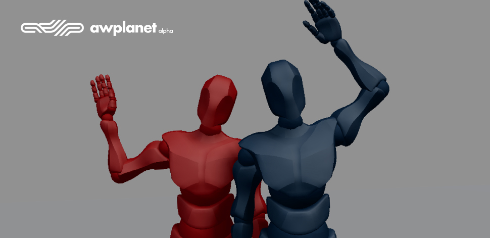
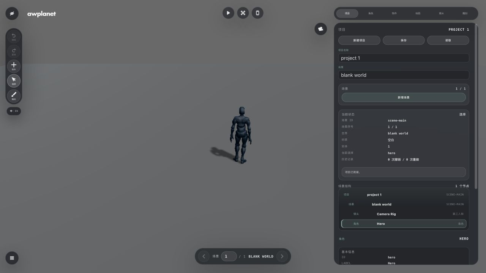
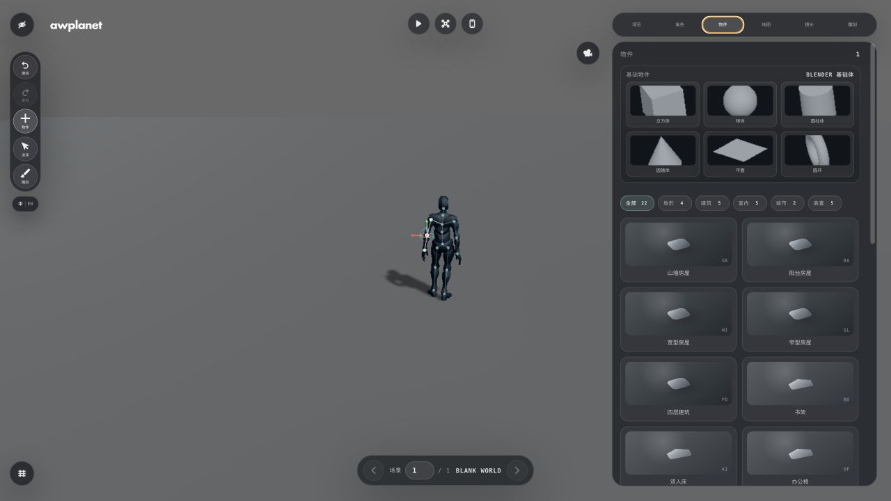
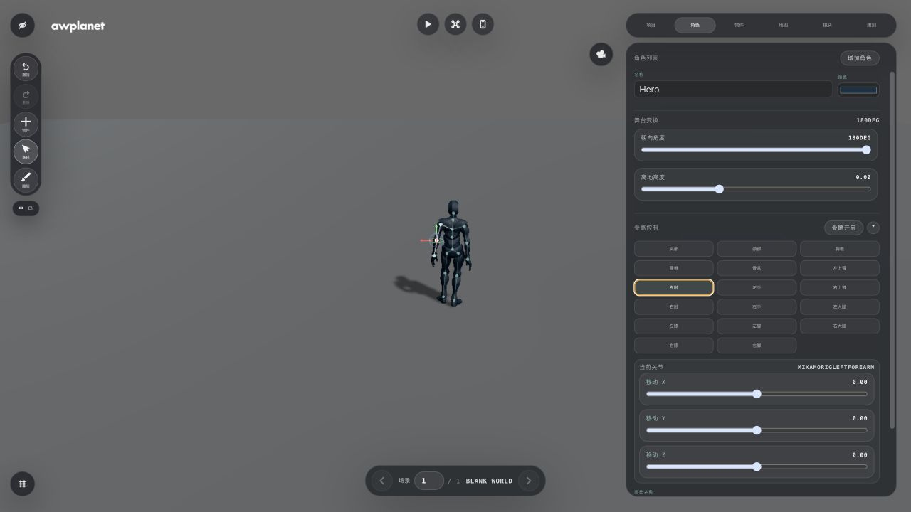
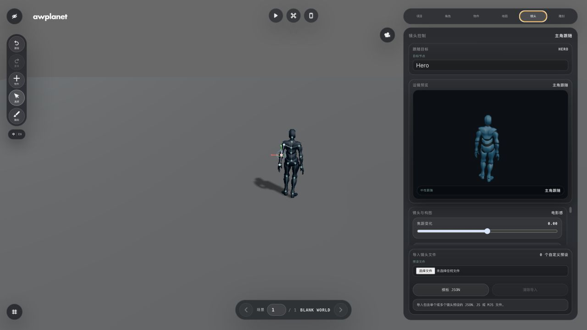
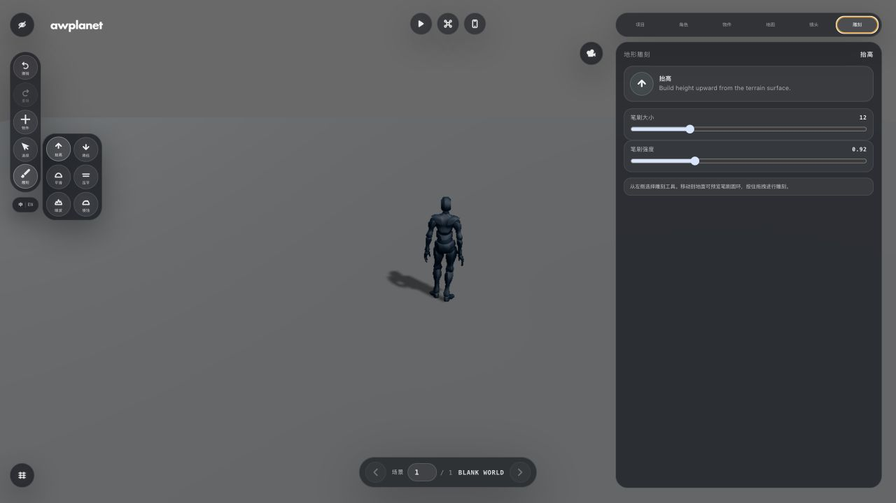
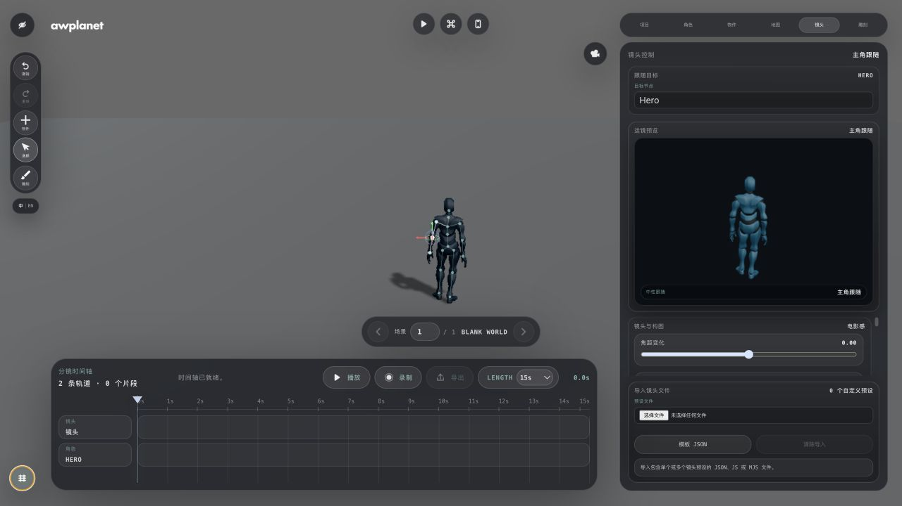
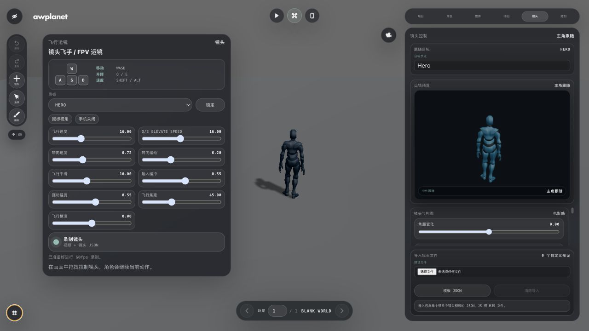
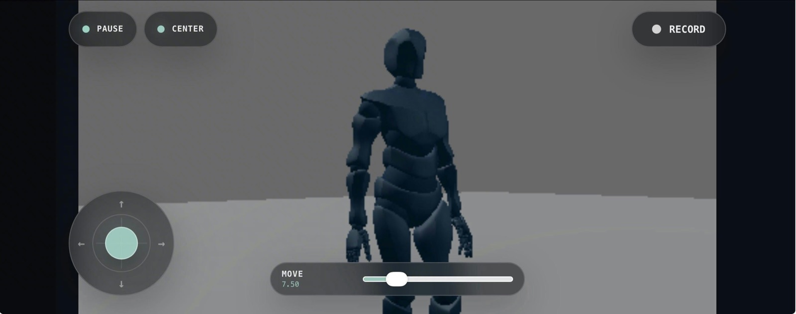

# awplanet

## 项目简介 / About

awplanet 是一款基于 React、Three.js、Vite 与 Electron 构建的 AI 原生 3D
导演工作台与场景创作工具。它将可视化场景编辑、角色控制、骨骼姿势、电影化运镜、
分镜时间轴、地形雕刻、物件布置和手机虚拟拍摄整合在同一套工作流中。

项目提供第三人称游戏视角、FPV 无人机运镜和手机虚拟拍摄三种导演模式，并支持
macOS Apple Silicon 与 Windows x64 桌面端。浏览器版 Phone Pilot 可以通过手机
方向传感器和虚拟摇杆控制电脑端镜头。

本项目以源码可用方式发布，非商业使用遵循
[PolyForm Noncommercial License 1.0.0](LICENSE.txt)；商业使用需要获得
DynamicWang 的单独书面授权，详情见
[商业使用与合作说明](COMMERCIAL-LICENSE.md)。

桌面体验包可从 [GitHub Releases](https://github.com/awplanets/awplanet/releases)
下载。

awplanet is a source-available, AI-native 3D direction and scene creation studio
built with React, Three.js, Vite, and Electron. It combines a visual scene
editor, playable character controls, skeletal posing, cinematic camera tools,
a storyboard timeline, terrain sculpting, object placement, and virtual
production with a phone.

The project provides three director modes: third-person play, FPV camera
piloting, and phone-based virtual production. Desktop builds support macOS
Apple Silicon and Windows x64. The browser-based Phone Pilot controls the
desktop camera through phone orientation sensors and a virtual joystick.

This project is source-available under the
[PolyForm Noncommercial License 1.0.0](LICENSE.txt) for permitted
noncommercial use. Commercial use requires separate written authorization from
DynamicWang. See the
[Commercial Use and Collaboration Policy](COMMERCIAL-LICENSE.md).

Desktop builds are available from
[GitHub Releases](https://github.com/awplanets/awplanet/releases).



## 功能界面 / Interface Tour

<table>
  <tr>
    <td width="50%">
      
      <br><strong>项目与场景 / Project & Scene</strong><br>
      管理项目、场景、实体状态和编辑历史。<br>
      <em>Manage projects, scenes, entity state, and editing history.</em>
    </td>
    <td width="50%">
      
      <br><strong>物件资源库 / Object Library</strong><br>
      放置基础几何体、建筑、室内、城市和地形资产。<br>
      <em>Place primitive geometry, architecture, interior, city, and terrain assets.</em>
    </td>
  </tr>
  <tr>
    <td width="50%">
      
      <br><strong>角色与骨骼 / Character Rig</strong><br>
      编辑角色颜色、姿势、关节和舞台变换。<br>
      <em>Edit character color, poses, joints, and stage transforms.</em>
    </td>
    <td width="50%">
      
      <br><strong>电影化镜头 / Cinematic Camera</strong><br>
      使用目标跟随、构图、焦距和电影化运镜预设。<br>
      <em>Use target tracking, composition, focal length, and cinematic shot presets.</em>
    </td>
  </tr>
  <tr>
    <td width="50%">
      
      <br><strong>地形雕刻 / Terrain Sculpt</strong><br>
      通过抬高、降低、平滑、压平、噪波和侵蚀塑造地形。<br>
      <em>Shape terrain with raise, lower, smooth, flatten, noise, and erosion tools.</em>
    </td>
    <td width="50%">
      
      <br><strong>分镜时间轴 / Storyboard Timeline</strong><br>
      录制、编排、回放并导出镜头与角色轨道。<br>
      <em>Record, arrange, replay, and export camera and character tracks.</em>
    </td>
  </tr>
</table>

### 三种导演模式 / Director Modes

<table>
  <tr>
    <td width="33%">
      <strong>游戏模式 / Play Mode</strong><br><br>
      直接控制场景中的角色进行行走与奔跑，并可在第三人称、第一人称和
      45° 等距视角之间切换。适合验证角色动作、碰撞、地面接触和场景的实际可玩性，
      同时支持以 60fps 录制运行画面。<br><br>
      <em>Control the character directly for walking and running, and switch
      between third-person, first-person, and 45° isometric views. Use it to
      validate animation, collision, ground contact, and actual playability,
      with 60fps scene recording.</em>
    </td>
    <td width="33%">
      <strong>FPV 飞行运镜 / FPV Camera Pilot</strong><br><br>
      使用 WASD、Q/E 和鼠标驾驶自由镜头，通过飞行速度、输入缓冲、转向缓动、
      摆动幅度和焦距等参数塑造稳定器或无人机式运镜。镜头可锁定角色，并可导出
      视频与 Camera JSON。<br><br>
      <em>Fly a free camera with WASD, Q/E, and the mouse. Tune flight speed,
      input lag, look easing, swing, and focal length for gimbal- or drone-like
      motion. Lock onto a character and export video with Camera JSON.</em>
    </td>
    <td width="33%">
      <strong>手机虚拟拍摄 / Phone Pilot</strong><br><br>
      将手机变成与桌面端同步的虚拟取景器。转动手机控制镜头方向，虚拟摇杆控制
      前后左右位移，并提供暂停、重新校准、位移幅度和远程录制。适合手持式虚拟
      摄影与多人协作取景。<br><br>
      <em>Turn a phone into a synchronized virtual viewfinder. Device rotation
      controls lens direction, while the joystick handles positional movement.
      Pause, recenter, scale movement, and trigger recording remotely for
      handheld virtual production and collaborative framing.</em>
    </td>
  </tr>
</table>



## Highlights

- Visual 3D editor with project, character, object, world, camera, and brush tools.
- Third-person play mode, FPV camera pilot, and virtual production workflows.
- Character pose and skeletal rig controls.
- Camera presets, target locking, lens controls, recording, and timeline replay.
- Terrain sculpting and multiple world materials.
- Object placement and transform gizmos.
- Browser phone pilot with orientation tracking and a virtual movement joystick.
- Desktop packages for macOS Apple Silicon and Windows x64.

## Quick Start

Requirements:

- Node.js 20 or newer
- npm 10 or newer

```bash
git clone https://github.com/awplanets/awplanet.git
cd awplanet
npm install
npm run dev
```

Open the local URL printed by Vite.

## Desktop App

Run the Electron desktop shell locally:

```bash
npm run desktop:start
```

Build platform packages:

```bash
npm run desktop:make:mac
npm run desktop:make:windows
```

Generated packages are written to `out/make`. The macOS command currently
targets Apple Silicon (`arm64`); the Windows command targets 64-bit Windows
(`x64`).

Packaged desktop builds are also published on the GitHub Releases page.

## Phone Pilot Web

The `/phone-pilot` route is the browser-based mobile controller. It mirrors the
desktop viewport, keeps horizontal phone orientation tracking, and provides a
circular joystick for deliberate forward, backward, and lateral camera motion.
Connect and pause controls are available directly on the phone page.



The phone interface keeps the live camera view visible while providing
connect/pause, recenter, recording, a compact movement joystick, and adjustable
movement scale. Horizontal device orientation controls the lens direction while
the joystick provides deliberate positional movement.

Motion sensors require HTTPS on mobile browsers. For a temporary public HTTPS
URL:

```bash
brew install cloudflared
npm run phone:web
```

Open the generated URL ending in `/phone-pilot` on the phone.

For local-network HTTPS:

```bash
npm run dev:https
```

The native iOS/ARKit companion is intentionally not included in this repository.

## Project Structure

- `src/engine`: runtime state, rendering, assets, physics, and commands.
- `src/editor`: editor shell, panels, timeline, and viewport tools.
- `src/phone`: browser phone pilot interface.
- `electron`: desktop application entry point and local server.
- `server`: phone pilot synchronization middleware.
- `public`: runtime assets and third-party license files.

## Verification

```bash
npm run lint
npm run build
npm run verify:rig
```

## Contributing

Issues and focused pull requests are welcome. Keep new systems separated across
runtime, editor, and command layers, and include attribution for added assets.

## Assets

Third-party icons, models, textures, and other assets remain under their
respective licenses. Review `THIRD-PARTY-NOTICES.md` and the license files kept
beside individual asset collections before redistributing them.

## License And Commercial Use

awplanet is source-available under the
[PolyForm Noncommercial License 1.0.0](LICENSE.txt). The repository may be used,
modified, and redistributed only for purposes permitted by that license.
Commercial use requires a separate written license from DynamicWang. See
[COMMERCIAL-LICENSE.md](COMMERCIAL-LICENSE.md) for the commercial-use and
collaboration policy.

This is a source-available project and is not distributed under an OSI-approved
open-source license.

## Copyright And Trademark

Copyright (c) 2026 DynamicWang.

Except for separately identified third-party components, the awplanet name,
logo, trademarks, original software, interface design, and related intellectual
property are owned by DynamicWang. The repository license does not grant
permission to use the awplanet name, logo, or trademarks for derived product
branding. See `LICENSE.txt`, `COMMERCIAL-LICENSE.md`, and `NOTICE.md`.
